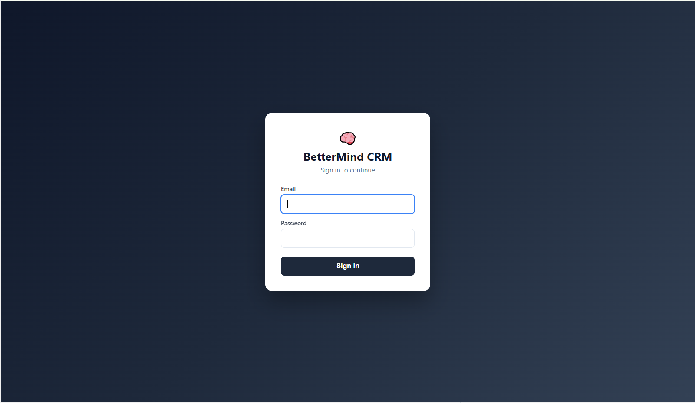
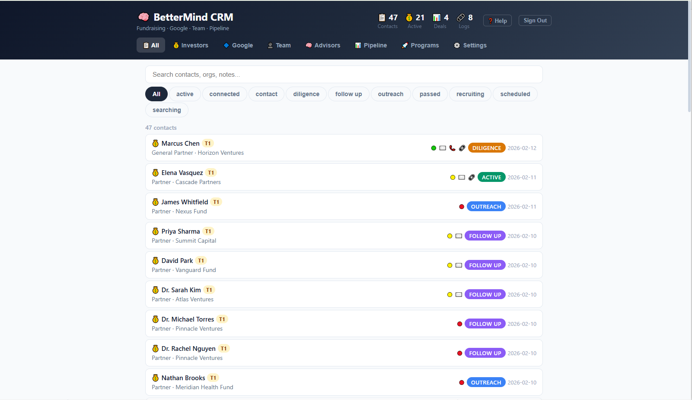
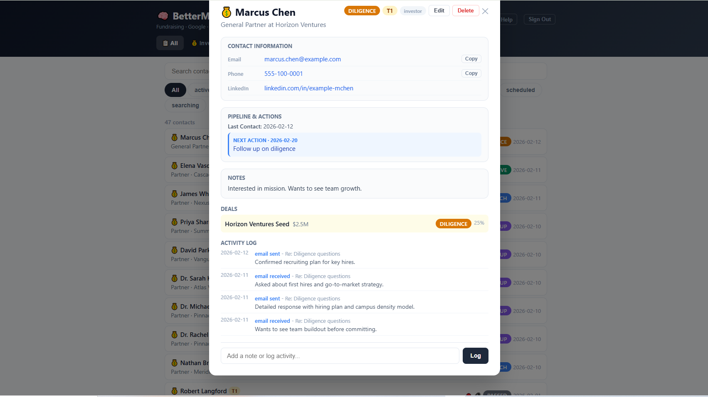
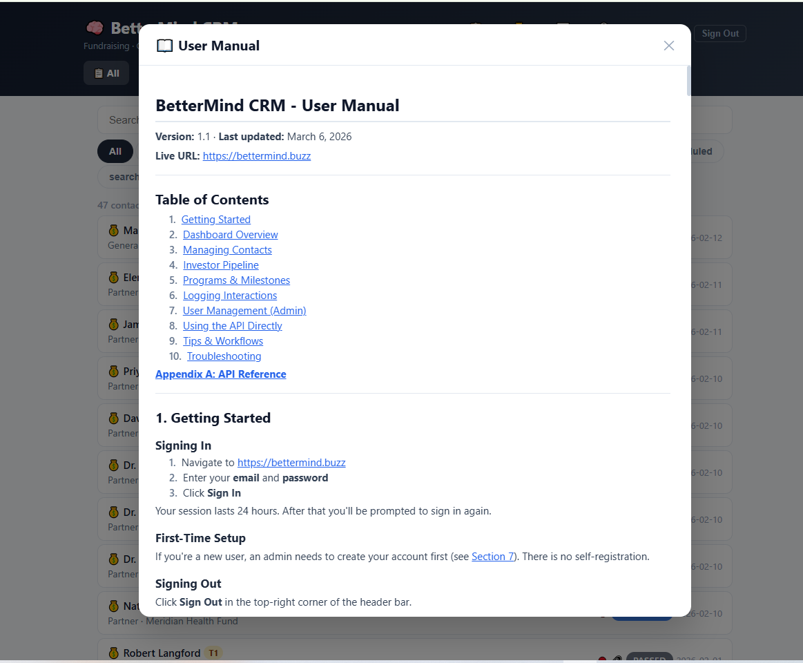

# Investor-CRM

[](LICENSE)
[](https://fastapi.tiangolo.com)
[](https://react.dev)
[](docs/CLOUD_DEPLOYMENT.md)
[](CONTRIBUTING.md)

> Open source investor pipeline and contact management for startups. Built by founders, for founders.

**Live:** [https://bettermind.buzz](https://bettermind.buzz)

<!-- TODO: Add screenshot of dashboard here -->
<!--  -->

## Why This Exists

Fundraising is chaos. Spreadsheets break. Notion gets messy. Expensive CRMs are overkill for a seed-stage startup tracking 50 investors. BetterMind CRM is the investor tracking tool we built for ourselves and are now sharing with the community.

## Features

- **Investor pipeline tracking** with customizable stages and probability tracking
- **Dynamic categories and subcategories** managed via API with icons, display names, and sort order
- **Contact management** with dynamic categories (investor, Google, team, advisor, legislator, partner, vendor, university, media, other)
- **Organization directory** linking contacts to companies and firms
- **Interaction logging** for emails, calls, meetings, and notes
- **Multi-user support** with role-based access (admin / user)
- **Tag system** for flexible categorization
- **Contact Info Card** with clickable email, phone, LinkedIn, website, Twitter/X, and Google Maps links
- **Inline edit mode** for updating contact details without leaving the detail view
- **In-app help** with a built-in user manual viewer
- **Full REST API** with interactive docs (FastAPI / Swagger at `/docs`)
- **Cloud-hosted** on Cloudflare Pages + Fly.io + Neon PostgreSQL (~$3-5/month)
- **Mobile-responsive** React frontend
- **PostgreSQL** database (Neon serverless) with automated backups and point-in-time restore

## Quick Start

### Option 1: Cloud Deployment (production — recommended)

The CRM runs on **Cloudflare Pages** (frontend) + **Fly.io** (backend) + **Neon PostgreSQL** (database).

See [docs/CLOUD_DEPLOYMENT.md](docs/CLOUD_DEPLOYMENT.md) for the full deployment guide.

**Deploy commands (after initial setup):**

```powershell
# Backend
fly deploy -a bettermind-crm-api

# Frontend
$env:CLOUDFLARE_API_TOKEN = "your-token"
.\deploy-cf-frontend.ps1
```

### Option 2: Local Development

```bash
# Backend
cd backend
python -m venv .venv
source .venv/bin/activate  # Windows: .venv\Scripts\activate
pip install -r requirements.txt
python main.py
# API running at http://localhost:8080

# Frontend (in a second terminal, for hot reload during development)
cd frontend
npm install
npm run dev
# Dev server at http://localhost:5173 (proxies API to :8080)
```

### Option 3: Docker with PostgreSQL (local full stack)

```bash
git clone https://github.com/jessl2juice/Investor-CRM.git
cd Investor-CRM
docker-compose up -d
# Open http://localhost:8080
```

This starts **PostgreSQL 16** and the **FastAPI + React** app. The database schema is created automatically on first run with demo seed data.

Default login: `admin@example.com` / `changeme123!` (created on first run). Change via `SEED_ADMIN_EMAIL` and `SEED_ADMIN_PASSWORD` env vars.

## Screenshots

| Login | Dashboard | Contact Detail | Help / User Manual |
|-------|-----------|----------------|-------------------|
|  |  |  |  |

> **Live:** [bettermind.buzz](https://bettermind.buzz)

## Project Structure

```text
Investor-CRM/
  Dockerfile              # Multi-stage build (Node frontend + Python backend)
  Dockerfile.fly          # Fly.io backend-only Dockerfile
  docker-compose.yml      # PostgreSQL 16 + FastAPI app stack (local dev)
  fly.toml                # Fly.io deployment config
  deploy-fly-backend.ps1  # One-command backend deploy to Fly.io
  deploy-cf-frontend.ps1  # One-command frontend deploy to Cloudflare Pages
  backup-crm.ps1          # Weekly PostgreSQL backup script (Windows)
  import_data.py          # Import data from JSON backups into PostgreSQL
  export_from_cloud.py    # Export data from Cloud SQL (migration tool)
  .env.example            # Environment variable template
  backend/
    main.py               # FastAPI app entry point
    database.py           # Schema, migrations, seed data
    auth.py               # Token creation and verification
    models.py             # Pydantic request/response models
    deps.py               # Shared DB helpers
    routes/               # API route modules
      contacts.py
      organizations.py
      interactions.py
      deals.py
      programs.py
      categories.py       # Category & subcategory CRUD
    requirements.txt      # Python dependencies
    test_fixes.py         # API test suite
  frontend/
    src/
      App.jsx             # Main React app
      api.js              # API client with auth
      components/         # UI components
        ContactDetail.jsx
        HelpModal.jsx
        LoginScreen.jsx
        UserManagement.jsx
        ui.jsx
      index.css           # Global styles
      main.jsx            # Entry point
    vite.config.js        # Vite config with API proxy
    package.json
  test_categories.ps1     # Non-destructive category/subcategory test suite
  docs/
    CLOUD_DEPLOYMENT.md   # Cloud deployment guide (Cloudflare Pages + Fly.io + Neon)
    SELF_HOSTED.md        # Legacy self-hosted guide (Docker + Cloudflare Tunnel)
    DEPLOYMENT.md         # Legacy Cloud Run deployment guide
    USER_MANUAL.md        # End-user documentation
    API_REFERENCE.md      # Full API reference
```

## Tech Stack

| Layer | Technology |
|-------|-----------|
| **Backend** | Python 3.12, FastAPI, SQLAlchemy, Pydantic |
| **Frontend** | React 18, Vite 6 |
| **Database** | Neon PostgreSQL (cloud), PostgreSQL 16 (local Docker), SQLite (dev fallback) |
| **Auth** | HMAC token-based (stateless, 24-hour TTL) |
| **Infrastructure** | Cloudflare Pages (frontend) + Fly.io (backend) + Neon (database) |
| **DNS/SSL** | Cloudflare (free tier — auto-provisioned HTTPS) |
| **Backups** | Neon auto-backup with point-in-time restore and branching |

## Architecture

```text
                    Internet
                       |
         +-------------+-------------+
         |      Cloudflare Pages     |
         |   bettermind.buzz (CDN)   |
         |   React/Vite static SPA   |
         +-------------+-------------+
                       | HTTPS (API calls)
                       v
         +-------------+-------------+
         |          Fly.io           |
         |  bettermind-crm-api       |
         |  FastAPI (Python 3.12)    |
         |  256MB, shared CPU        |
         +-------------+-------------+
                       | postgresql+pg8000 (SSL)
                       v
         +-------------+-------------+
         |    Neon PostgreSQL        |
         |    bettermind_crm db      |
         |    Serverless, free tier  |
         +---------------------------+
```

**Always-on cloud infrastructure:**

- **Frontend** served globally via Cloudflare CDN — instant page loads
- **Backend** on Fly.io with `min_machines_running = 1` — no cold starts
- **Database** on Neon with auto-backup and point-in-time restore
- **SSL certificates** provisioned and renewed automatically by Cloudflare and Fly.io
- **Monthly cost: ~$3-5** — Cloudflare free tier + Fly.io hobby + Neon free tier
- **No PC required** — runs 24/7 in the cloud

## API Documentation

Interactive API docs are available at `/docs` (Swagger UI) when running locally or in production.

Full reference: [docs/API_REFERENCE.md](docs/API_REFERENCE.md)

### Key Endpoints

| Method | Endpoint | Description |
|--------|----------|-------------|
| POST | `/api/login` | Authenticate and get token |
| GET | `/api/contacts` | List contacts (filterable, searchable) |
| POST | `/api/contacts` | Create contact |
| GET | `/api/contacts/{id}` | Get contact with interactions and deals |
| PUT | `/api/contacts/{id}` | Update contact (partial) |
| DELETE | `/api/contacts/{id}` | Delete contact |
| GET | `/api/categories` | List categories with subcategories |
| POST | `/api/categories` | Create a category |
| GET | `/api/subcategories` | List subcategories (filterable by category) |
| GET | `/api/organizations` | List organizations |
| GET | `/api/deals` | List deals (pipeline) |
| GET | `/api/programs` | List programs |
| GET | `/api/stats` | Dashboard statistics |
| GET | `/api/help` | User manual content |

## Environment Variables

| Variable | Required | Description |
|----------|----------|-------------|
| `DATABASE_URL` | Docker | Full PostgreSQL connection string (set in `docker-compose.yml`) |
| `TOKEN_SECRET` | Yes | Secret for signing auth tokens. Generate: `python -c "import secrets; print(secrets.token_hex(32))"` |
| `PORT` | No | Server port (default: `8080`) |
| `ALLOWED_ORIGINS` | No | Comma-separated list of allowed CORS origins |
| `VITE_API_BASE_URL` | Build-time | Frontend API base URL (e.g., `https://bettermind-crm-api.fly.dev`). Defaults to relative `/api` |

When `DATABASE_URL` is set, the app connects to PostgreSQL via pg8000 with automatic SSL detection for Neon. Otherwise, it falls back to SQLite for local development.

See [.env.example](.env.example) for a template.

## Backups

**Neon (cloud — current):** Neon provides automatic daily backups and point-in-time restore via branching. Create a branch before risky migrations:

```powershell
# Create a branch in Neon dashboard or via API
# https://console.neon.tech → bettermind-crm → Branches → Create Branch
```

**Local Docker (legacy):** The `backup-crm.ps1` script creates date-stamped PostgreSQL dumps for local Docker deployments. See [docs/SELF_HOSTED.md](docs/SELF_HOSTED.md) for details.

## Data Import / Export

### Import from JSON backups

```bash
python import_data.py
```

The `import_data.py` script loads data from JSON files (`orgs_full.json`, `contacts_full.json`, etc.), preserves original IDs, resets PostgreSQL sequences, and creates user accounts.

## Design Decisions

- **Single-file frontend** (`App.jsx`): keeps the CRM simple and deployable without a complex build pipeline. All state is local React state with `useState`/`useMemo`.
- **No ORM models**: raw SQL via `sqlalchemy.text()` for full control and transparency. Schema defined as DDL strings in `database.py`.
- **Dynamic category management**: categories and subcategories are stored in database tables (not hardcoded enums), with CRUD endpoints and runtime validation. Seeded idempotently on startup.
- **Dual database support**: PostgreSQL via `DATABASE_URL` or Cloud SQL Connector, with SQLite fallback. Detected at startup.
- **Stateless auth**: HMAC tokens with embedded claims (email, role, password version). No session store needed. 24-hour TTL.
- **Migration-safe schema evolution**: new columns added via `ALTER TABLE ADD COLUMN IF NOT EXISTS` (PostgreSQL) or `try/except` (SQLite), so existing databases upgrade transparently on startup.
- **Cloud-native**: migrated from Docker Desktop + Cloudflare Tunnel to Cloudflare Pages + Fly.io + Neon PostgreSQL (~$3-5/month) for 24/7 availability without tying up a PC.

## Migration History

| Date | From | To | Cost |
|------|------|----|------|
| March 2026 | Google Cloud Run + Cloud SQL (~$150/mo) | Docker Desktop + Cloudflare Tunnel ($0/mo) | $0/mo |
| April 2026 | Docker Desktop + Cloudflare Tunnel ($0/mo) | Cloudflare Pages + Fly.io + Neon (~$3-5/mo) | ~$3-5/mo |

All GCP resources were deleted in March 2026. The local Docker setup was decommissioned in April 2026.

See [docs/CLOUD_DEPLOYMENT.md](docs/CLOUD_DEPLOYMENT.md) for the current deployment guide.

## Contributing

We welcome contributions! See [CONTRIBUTING.md](CONTRIBUTING.md) for guidelines on:

- Reporting bugs
- Suggesting features
- Submitting pull requests
- Code style (Python: PEP 8, JS: ESLint defaults)

## License

MIT License. See [LICENSE](LICENSE) for details.

## Built By

[BetterMind.Space](https://bettermind.space) | [Clinician Assist Inc.](https://clinicianassist.ai)

Originally built to manage our own $2.5M seed fundraise across 35+ investors. Now open source for every founder who needs it.
